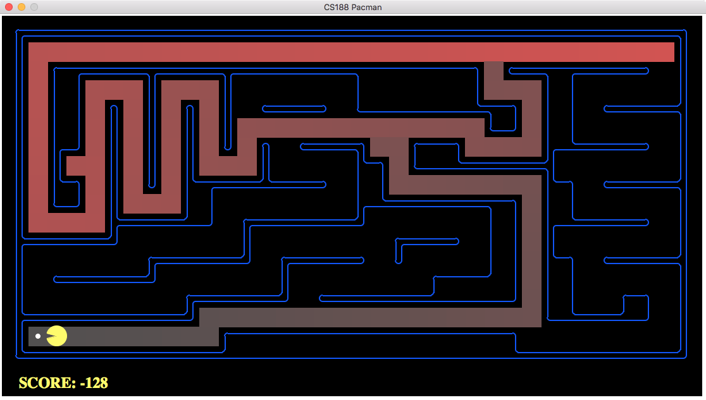
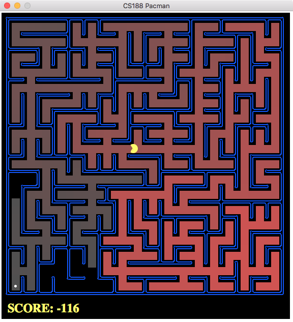
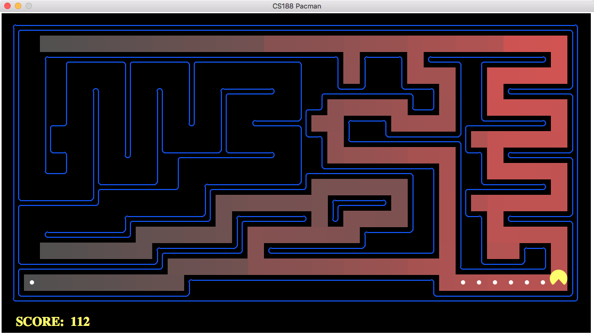
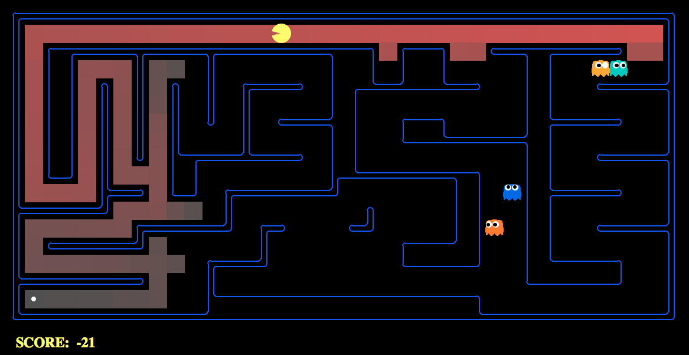

> CENTRO FEDERAL DE EDUCAÇÃO TECNOLÓGICA DE MINAS GERAIS
> ENGENHARIA DE COMPUTAÇÃO
> LABORATÓRIO DE INTELIGÊNCIA ARTIFICIAL
> Prof. Flávio Cruzeiro

## TRABALHO PRÁTICO I: PACMAN
#### por Pedro Felipe Froes & Saulo Antunes


##### Passo 1: Implementação da DFS
Para implementar o algoritmo de busca em profundidade (DFS, *depth first search*), foram utilizados as funções pré-implementadas no arquivo `util.py` de pilha (`util.Stack()`) em conjunto com os métodos para obter o estado inicial, obter os estados sucessores do estado atual e verificar se o mesmo é o final.

A primeira ação do DFS é colocar o estado inicial em uma pilha. O algoritmo então:

1. Verifica se o estado do topo não é equivalente ao estado final do labirinto, caso contrário;
1. Marca o estado como visitado (`visited[currentState] = true`) e;
1. Coloca os estados sucessores do estado atual em uma pilha, sempre considerando o caminho necessário até chegar nele próprio (dá `push` na tupla `(state, path + [action])`, onde `path` representa o caminho até ele próprio e `action` representa a ação para o chegar ao sucessor).

Os itens 1, 2 e 3 são repetidos até a fila estiver vazia, ou até encontrar o caminho solução. Além disso, esses três passos são repetidos com poucas alterações em todos os algoritmos posteriores (é um passo-a-passo de um algoritmo de busca genérico).

**A ordem de exploração foi de acordo com o esperado? O Pacman realmente passa por  todos os estados explorados no seu caminho para o objetivo?**


*Testando a DFS em um* `mediumMaze`*.*

Na figura acima, os estados são coloridos mais intensamente de acordo com o número de vezes que foram visitados pela DFS. Assim, os estados com um vermelho mais vivo foram visitados mais vezes pelo algoritmo, enquanto os estados não coloridos nem chegam a ser explorados. Portanto, o Pacman não passa por todos os estados explorados, e sim apenas pelo caminho que o levará até seu objetivo.

A ordem de exploração ocorreu de acordo com o esperado, com 146 nós expandidos, e com um custo total de 130 para o `mediumMaze`.

```
Path found with total cost of 130 in 0.0 seconds
Search nodes expanded: 146
Pacman emerges victorious! Score: 380
Average Score: 380.0
Scores:        380
Win Rate:      1/1 (1.00)
Record:        Win
```

Para o `tiny maze`, esse número foi de 10, e no `bigMaze`,  210. É possível ainda verificar que, quando os sucessores são colocados em ordem reversa (no item 3, através do método `reversed`, o custo do caminho é, de fato, 246 para o `mediumMaze`.

```
Path found with total cost of 246 in 0.0 seconds
Search nodes expanded: 269
Pacman emerges victorious! Score: 264
Average Score: 264.0
Scores:        264
Win Rate:      1/1 (1.00)
Record:        Win
```

**Essa é uma solução ótima? Se não, o que a busca em profundidade está fazendo de errado?**

Embora a DFS seja completa com a verificação de estados já visitados, ela não pode ser considerada ótima, pois ela retorna o primeiro caminho até o objetivo – e o primeiro caminho encontrado nem sempre é o caminho ótimo até o mesmo.

##### Passo 2: Implementação da BFS
A busca em extensão (BFS, *breath first search*) tem implementação similar à DFS, sendo que ao invés de uma TAD pilha, ela utiliza uma estrutura de fila. Dessa forma, a BFS explora primeiro os nós irmãos para depois explorar os nós filhos e os filhos dos nós irmãos.

A implementação é análoga aos 3 passos da DFS, exceto que foi utilizada uma `util.Queue()` ao invés da pilha. O custo para o `bigMaze` (mostrado na figura abaixo) foi de 210, enquanto o do `mediumMaze` foi de 68. O `bigMaze` foi executado com o mesmo custo que o DFS; o `mediumMaze`, no entanto, teve uma diferença de custo de 62 em relação à DFS, ou seja, o seu custo foi quase duas vezes menor.


*BFS no* `bigMaze`*.*

**A busca BFS encontra a solução ótima?**

Sim, a BFS retorna o primeiro caminho encontrado, da mesma maneira que a DFS. A diferença é que o primeiro caminho da BFS é o caminho ótimo, algo que não é necessariamente verdade na DFS.

É possível testar essa implementação da BFS com o jogo do quebra-cabeça de 8 peças. Para o quebra-cabeça aleatório abaixo, a BFS encontra a solução ótima em 13 movimentos.

```
A random puzzle:
-------------
| 6 | 5 | 3 |
-------------
|   | 1 | 2 |
-------------
| 7 | 4 | 8 |
-------------
BFS found a path of 13 moves: ['right', 'up', 'right', 'down', 'left', 'left', 'up', 'right', 'down', 'down', 'left', 'up', 'up']
After 1 move: right
-------------
| 6 | 5 | 3 |
-------------
| 1 |   | 2 |
-------------
| 7 | 4 | 8 |
-------------
Press return for the next state...
After 2 moves: up
-------------
| 6 |   | 3 |
-------------
| 1 | 5 | 2 |
-------------
| 7 | 4 | 8 |
-------------
Press return for the next state...

[…]

After 13 moves: up
-------------
|   | 1 | 2 |
-------------
| 3 | 4 | 5 |
-------------
| 6 | 7 | 8 |
-------------
```

##### Passo 3: Variando a função de custo
A DFS e a BFS não consideravam o custo para a sequência de movimentos do Pacman. Para implementar um algoritmo que considera custos diferentes entre os possíveis movimentos – nesse caso, a busca de custo uniforme – basta realizar duas alterações no algoritmo genérico de busca: o passo 3 considera agora o custo em conjunto com o estado e a ação dos sucessores do estado atual, e uma fila de prioridades é utilizada em detrimento de uma pilha ou fila regular.

Para o `mediumMaze` regular utilizado, a busca teve custo total de 152.
**{{DUVIDA: não deveria ser equivalente ao BFS? SIMMM!}}**

Para os labirintos com comida (`mediumDottedMaze`) e com fantasmas (`mediumScaryMaze`), foram obtidos custos de 1 e aproximadamente 68 milhões, respectivamente. O custo no labirinto com fantasmas é alto devido ao constante movimento de cada um dos fantasmas, que influencia na decisão do Pacman de qual caminho seguir.


*Busca de custo uniforme no* `mediumDottedMaze`*.*

```
Path found with total cost of 1 in 0.0 seconds
Search nodes expanded: 188
Pacman emerges victorious! Score: 646
Average Score: 646.0
Scores:        646
Win Rate:      1/1 (1.00)
Record:        Win
```


*Busca de custo uniforme no* `mediumScaryMaze`*.*

```
Path found with total cost of 68719479864 in 0.0 seconds
Search nodes expanded: 92
Pacman emerges victorious! Score: 418
Average Score: 418.0
Scores:        418
Win Rate:      1/1 (1.00)
Record:        Win
```

##### Passo 4: Busca A*

