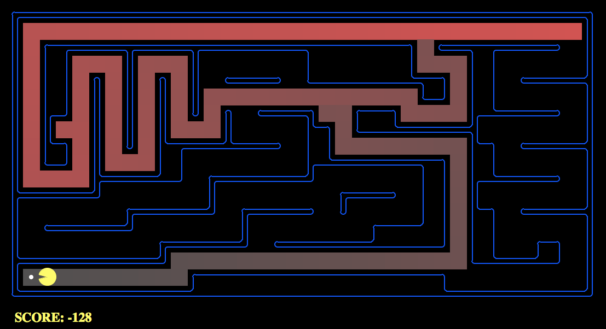
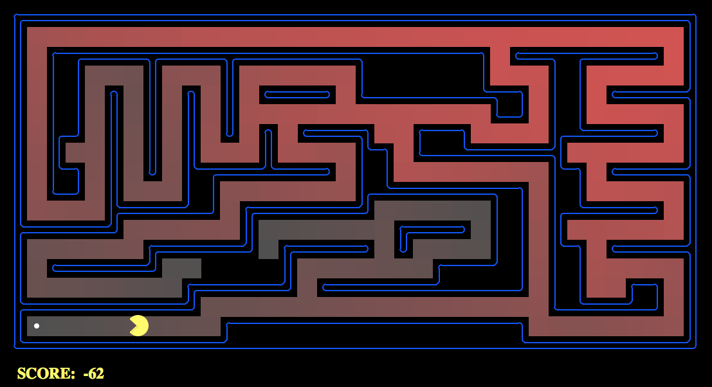
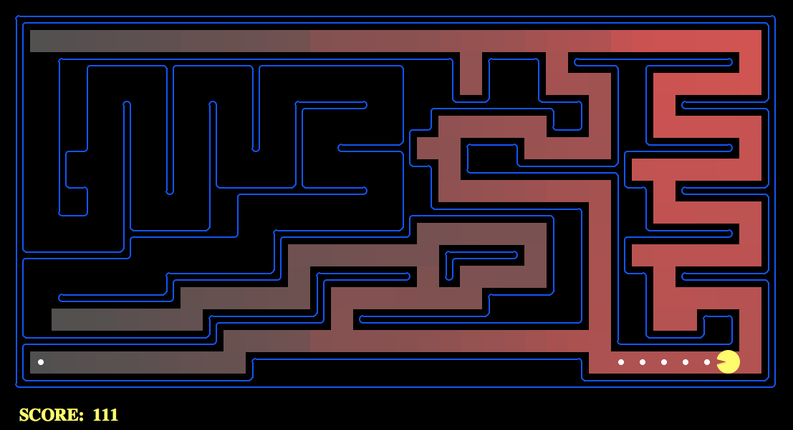

**CENTRO FEDERAL DE EDUCAÇÃO TECNOLÓGICA DE MINAS GERAIS**

**ENGENHARIA DE COMPUTAÇÃO**

**LABORATÓRIO DE INTELIGÊNCIA ARTIFICIAL**

**Prof. Flávio Cruzeiro**

### TRABALHO PRÁTICO I: PACMAN
###### por Pedro Felipe Froes & Saulo Antunes

***

##### Passo 1: Implementação da DFS
Para implementar o algoritmo de busca em profundidade (DFS, *depth first search*), foram utilizados as funções pré-implementadas no arquivo `util.py` de pilha (`util.Stack()`) em conjunto com os métodos para obter o estado inicial, obter os estados sucessores do estado atual e verificar se o mesmo é o final.

A primeira ação do DFS é colocar o estado inicial em uma pilha. O algoritmo então:

1. Verifica se o estado do topo não é equivalente ao estado final do labirinto, caso contrário;
1. Marca o estado como visitado (`visited[currentState] = true`) e;
1. Coloca os estados sucessores do estado atual em uma pilha, sempre considerando o caminho necessário até chegar nele próprio (dá `push` na tupla `(state, path + [action])`, onde `path` representa o caminho até ele próprio e `action` representa a ação para o chegar ao sucessor).

Os itens 1, 2 e 3 são repetidos até a fila estiver vazia, ou até encontrar o caminho solução. Além disso, esses três passos são repetidos com poucas alterações em todos os algoritmos posteriores (é um passo-a-passo de um algoritmo de busca genérico).

**A ordem de exploração foi de acordo com o esperado? O Pacman realmente passa por  todos os estados explorados no seu caminho para o objetivo?**



Na figura acima, os estados são coloridos mais intensamente de acordo com a ordem de visitação pela DFS. Assim, os estados com um vermelho mais vivo foram visitados antes dos estados coloridos de um vermelho menos intenso, enquanto os estados não coloridos nem chegam a ser explorados. Portanto, o Pacman não passa por todos os estados explorados, e sim apenas pelo caminho que o levará até seu objetivo.

A ordem de exploração ocorreu de acordo com o esperado, com 146 nós expandidos, e com um custo total de 130 para o `mediumMaze`.

`$ python pacman.py -l mediumMaze -p SearchAgent`

```
[SearchAgent] using function depthFirstSearch
[SearchAgent] using problem type PositionSearchProblem
Path found with total cost of 130 in 0.0 seconds
Search nodes expanded: 146
Pacman emerges victorious! Score: 380
Average Score: 380.0
Scores:        380
Win Rate:      1/1 (1.00)
Record:        Win
```

Para o `tinyMaze`, esse número foi de 10, e no `bigMaze`,  210. É possível ainda verificar que, quando os sucessores são colocados em ordem reversa (no item 3, através do método `reversed`, o custo do caminho é, de fato, 246 para o `mediumMaze`.

`$ python pacman.py -l mediumMaze -p SearchAgent`

```
[SearchAgent] using function depthFirstSearch
[SearchAgent] using problem type PositionSearchProblem
Path found with total cost of 246 in 0.0 seconds
Search nodes expanded: 269
Pacman emerges victorious! Score: 264
Average Score: 264.0
Scores:        264
Win Rate:      1/1 (1.00)
Record:        Win
```

**Essa é uma solução ótima? Se não, o que a busca em profundidade está fazendo de errado?**

Embora a DFS seja completa com a verificação de estados já visitados, ela não pode ser considerada ótima, pois ela retorna o primeiro caminho até o objetivo – e o primeiro caminho encontrado nem sempre é o caminho ótimo até o mesmo.

##### Passo 2: Implementação da BFS
A busca em extensão (BFS, *breath first search*) tem implementação similar à DFS, sendo que ao invés de uma TAD pilha, ela utiliza uma estrutura de fila. Dessa forma, a BFS explora primeiro os nós irmãos para depois explorar os nós filhos e os filhos dos nós irmãos.

A implementação é análoga aos 3 passos da DFS, exceto que foi utilizada uma `util.Queue()` ao invés da pilha. O custo para o `bigMaze` (mostrado na figura abaixo) foi de 210, enquanto o do `mediumMaze` foi de 68. O `bigMaze` foi executado com o mesmo custo que o DFS; o `mediumMaze`, no entanto, teve uma diferença de custo de 62 em relação à DFS, ou seja, o seu custo foi quase duas vezes menor.



`$ python pacman.py -l mediumMaze -p SearchAgent -a fn=bfs`

```
[SearchAgent] using function bfs
[SearchAgent] using problem type PositionSearchProblem
Path found with total cost of 68 in 0.0 seconds
Search nodes expanded: 275
Pacman emerges victorious! Score: 442
Average Score: 442.0
Scores:        442
Win Rate:      1/1 (1.00)
Record:        Win
```

**A busca BFS encontra a solução ótima?**

Sim, a BFS retorna o primeiro caminho encontrado, da mesma maneira que a DFS. A diferença é que o primeiro caminho da BFS é o caminho ótimo, algo que não é necessariamente verdade na DFS.

É possível testar essa implementação da BFS com o jogo do quebra-cabeça de 8 peças. Para o quebra-cabeça aleatório abaixo, a BFS encontra a solução ótima em 13 movimentos.

`$ python eightpuzzle.py`

```
A random puzzle:
-------------
| 6 | 5 | 3 |
-------------
|   | 1 | 2 |
-------------
| 7 | 4 | 8 |
-------------
BFS found a path of 13 moves: ['right', 'up', 'right', 'down', 'left', 'left', 'up', 'right', 'down', 'down', 'left', 'up', 'up']
After 1 move: right
-------------
| 6 | 5 | 3 |
-------------
| 1 |   | 2 |
-------------
| 7 | 4 | 8 |
-------------
Press return for the next state...
After 2 moves: up
-------------
| 6 |   | 3 |
-------------
| 1 | 5 | 2 |
-------------
| 7 | 4 | 8 |
-------------
Press return for the next state...

[…]

After 13 moves: up
-------------
|   | 1 | 2 |
-------------
| 3 | 4 | 5 |
-------------
| 6 | 7 | 8 |
-------------
```

##### Passo 3: Variando a função de custo
A DFS e a BFS não consideravam o custo para a sequência de movimentos do Pacman. Para implementar um algoritmo que considera custos diferentes entre os possíveis movimentos – nesse caso, a busca de custo uniforme – basta realizar duas alterações no algoritmo genérico de busca: o passo 3 considera agora o custo em conjunto com o estado e a ação dos sucessores do estado atual, e uma fila de prioridades é utilizada em detrimento de uma pilha ou fila regular.


`$ python pacman.py -l mediumMaze -p SearchAgent -a fn=ucs`

```
[SearchAgent] using function ucs
[SearchAgent] using problem type PositionSearchProblem
Path found with total cost of 68 in 0.0 seconds
Search nodes expanded: 274
Pacman emerges victorious! Score: 442
Average Score: 442.0
Scores:        442
Win Rate:      1/1 (1.00)
Record:        Win
```

Para o `mediumMaze` regular utilizado, a busca teve custo total de 68, equivalente à `bfs`, dado que todos as direções no labirinto possuem custo idêntico. Já para os labirintos com comida (`mediumDottedMaze`) e com fantasmas (`mediumScaryMaze`), foram obtidos custos de 1 e aproximadamente 68 bilhões, respectivamente. O custo no labirinto com fantasmas é altíssimo devido ao constante movimento de cada um dos fantasmas, que influencia na decisão do Pacman de qual caminho seguir.



`$ python pacman.py -l mediumDottedMaze -p StayEastSearchAgent`

```
Warning: this does not look like a regular search maze
Path found with total cost of 1 in 0.0 seconds
Search nodes expanded: 190
Pacman emerges victorious! Score: 646
Average Score: 646.0
Scores:        646
Win Rate:      1/1 (1.00)
Record:        Win
```


`$ python pacman.py -l mediumScaryMaze -p StayWestSearchAgent`

```
Path found with total cost of 68719479864 in 0.0 seconds
Search nodes expanded: 108
Pacman emerges victorious! Score: 418
Average Score: 418.0
Scores:        418
Win Rate:      1/1 (1.00)
Record:        Win
```

##### Passo 4: Busca A*
A busca A* utiliza uma fila de prioridade com uma heurística, ou seja, uma função que influencia na decisão de qual caminho será seguido. Essa função pode ser definida como `f(n) = g(n) + h(n)`, onde `g(n)` representa o custo do caminho até o nó atual, e `h(n)` uma heurística a ser escolhida. Uma heurística comum para problemas de locomoção é a da distância Manhattan, que calcula a distância em L entre o nó atual e nó objetivo, e que já está implementada no arquivo `searchAgents.py`.


Para implementar a busca A*, foi então utilizada uma `PriorityQueue` cuja prioridade é definida por uma função heurística. Ao adicionar os nós sucessores durante o passo 3 do algoritmo de busca mostrado inicialmente, a busca `astar` considera o custo como o valor do caminho atual adicionado ao valor para chegar até o nó sucessor (`g(n)`), e isso é somado ao valor encontrado aplicando a heurística escolhida (`h(n)`).


`$ python pacman.py -l bigMaze -z .5 -p SearchAgent -a fn=astar,heuristic=manhattanHeuristic`

```
[SearchAgent] using function astar and heuristic manhattanHeuristic
[SearchAgent] using problem type PositionSearchProblem
Path found with total cost of 210 in 0.2 seconds
Search nodes expanded: 538
Pacman emerges victorious! Score: 300
Average Score: 300.0
Scores:        300
Win Rate:      1/1 (1.00)
Record:        Win
```

A busca A* de fato encontra a solução ótima um pouco mais rapidamente que a busca de custo uniforme, expandindo 538 nós contra os 619 nós expandidos com a aplicação da `ucs` no `bigMaze`. A diferença no algoritmo de ambas também pode ser percebida comparando a quantidade de estados vermelhos: a `ucs` visita uma quantidade maior que a `astar`, que por sua vez vai afunilando a quantidade de estados visitados assim que se aproxima da solução.


`$ python pacman.py -l bigMaze -z .5 -p SearchAgent -a fn=ucs`

```
[SearchAgent] using function ucs
[SearchAgent] using problem type PositionSearchProblem
Path found with total cost of 210 in 0.2 seconds
Search nodes expanded: 619
Pacman emerges victorious! Score: 300
Average Score: 300.0
Scores:        300
Win Rate:      1/1 (1.00)
Record:        Win
```

**O que acontece em** `openMaze` **para as várias estratégias de busca?**

No `openMaze`, devido as condições do labirinto, pode-se perceber uma diferença significante entre os algoritmos.

| Algoritmo | Custo | Nós Expandidos | Score |
|:---------:|:-----:|:--------------:|:-----:|
| DFS | 298 | 576 | 212 |
| BFS | 54 | 682 | 456 |
| UCS | 54 | 682 | 456 |
| A* | 54 | 211 | 456 |

O DFS não obteve uma solução ótima, pois retornou o primeiro caminho que chegava a solução. O BFS e o UCS tiveram o mesmo comportamento, isso acontece devido as ações possuírem o mesmo custo. Enquanto que o A* obteve o mesmo resultado porém com um número 3x menor em relação a quantidade de nós expandidos.


`$ python pacman.py -l openMaze -p SearchAgent -a fn=dfs`

```
[SearchAgent] using function dfs
[SearchAgent] using problem type PositionSearchProblem
Path found with total cost of 298 in 0.1 seconds
Search nodes expanded: 806
Pacman emerges victorious! Score: 212
Average Score: 212.0
Scores:        212
Win Rate:      1/1 (1.00)
Record:        Win
```


`$ python pacman.py -l openMaze -p SearchAgent -a fn=astar,heuristic=manhattanHeuristic`

```
[SearchAgent] using function astar and heuristic manhattanHeuristic
[SearchAgent] using problem type PositionSearchProblem
Path found with total cost of 54 in 0.0 seconds
Search nodes expanded: 211
Pacman emerges victorious! Score: 456
Average Score: 456.0
Scores:        456
Win Rate:      1/1 (1.00)
Record:        Win
```

##### Passo 5: Coletando comida
Para que o Pacman possa comer a comida no menor número de passos possíveis, uma heurística pode ser implementada considerando a posição do Pacman e das comidas no labirinto. Primeiramente, é possível verificar que, com uma heurística nula, a busca A* encontra a solução com custo 7 no problema `testSearch`.


`$ python pacman.py -l testSearch -p AStarFoodSearchAgent`

```
Path found with total cost of 7 in 0.0 seconds
Search nodes expanded: 8
Pacman emerges victorious! Score: 513
Average Score: 513.0
Scores:        513
Win Rate:      1/1 (1.00)
Record:        Win
```

Para implementar uma heurística que fizesse o Pacman comer todas as comidas no menor caminho, foi utilizado a posição do Pacman e das comidas no labirinto como estado. A cada estado, é possível listar onde as comidas estão no tabuleiro com o método `foodGrid.asList()`.

A heurística implementada consiste em analisar a distância Manhattan para todas as comidas restantes no labirinto (ou seja, todas as comidas restantes em `foods = foodGrid.asList()`). A distância é somada com os valores obtidos, retornando o valor para obter a comida mais próxima do Pacman. O procedimento anterior é repetido sucessivas vezes até que todas as comidas sejam consumidas no labirinto.


```python
def foodHeuristic(state, problem):

	position, foodGrid = state
  	foods = foodGrid.asList()
	distance = 0

	for food in foods:
		distance += util.manhattanDistance(food, position)
	
	return distance
```


`$ python pacman.py -l trickySearch -p AStarFoodSearchAgent`

```
Path found with total cost of 60 in 2.0 seconds
Search nodes expanded: 6076
Pacman emerges victorious! Score: 570
Average Score: 570.0
Scores:        570
Win Rate:      1/1 (1.00)
Record:        Win
```
